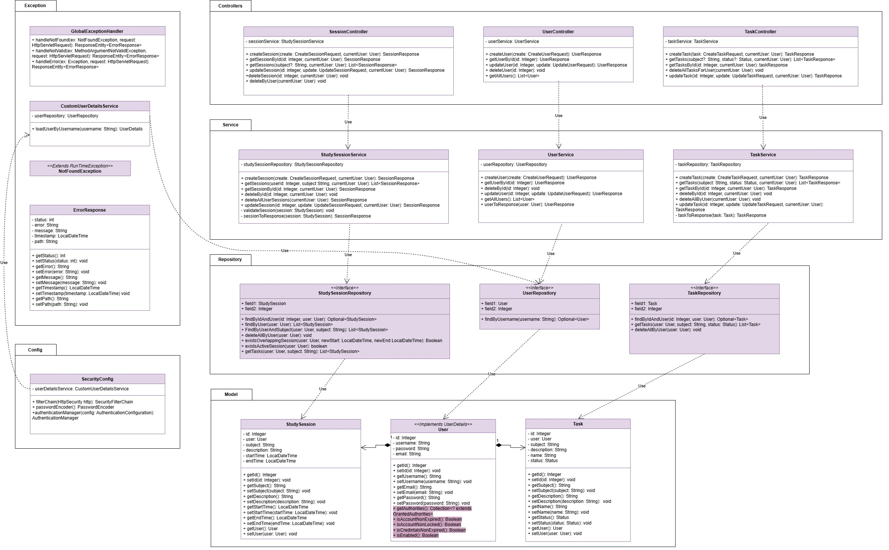

# 📚 Study Tracker

A full-stack application for managing study sessions and tasks. Built with a Spring Boot REST API backend and a vanilla JavaScript frontend.

---

## 🚀 Tech Stack

| Layer | Technology |
|-------|------------|
| Language | Java 17 |
| Framework | Spring Boot 3 |
| Security | Spring Security |
| Database | PostgreSQL |
| ORM | Spring Data JPA / Hibernate |
| Validation | Jakarta Bean Validation |
| Build Tool | Maven |
| Frontend | HTML / CSS / JavaScript |

---

## 📐 Architecture & UML Diagram

This project follows a layered architecture: **Controller → Service → Repository → Entity**



> *Class diagram showing Controllers, Services, Repositories, Models, Security config, and Exception handling*

---

## 🗂️ Project Structure

```
src/
├── controller/       # REST endpoints (TaskController, UserController, SessionController)
├── service/          # Business logic
├── repository/       # JPA interfaces for DB access
├── model/            # JPA entities (Task, User, StudySession)
├── dto/              # Request/Response objects
├── exception/        # GlobalExceptionHandler, NotFoundException, ErrorResponse
└── config/           # SecurityConfig, CustomUserDetailsService

frontend/
├── login.html
├── register.html
└── dashboard.html    # In progress
```

---

## 📋 Features

### Backend
- **Task Management** — Full CRUD with status tracking (`NOT_STARTED`, `IN_PROGRESS`, `COMPLETE`)
- **Study Sessions** — Log sessions with start/end times, overlap validation, and active session checks
- **User Management** — Full CRUD with user-scoped data access
- **Filtering** — Query tasks and sessions by `subject` and `status`
- **Authentication** — Spring Security with `CustomUserDetailsService` and `UserDetails` integration
- **Exception Handling** — Global exception handler returning structured `ErrorResponse` objects with status, message, and timestamp
- **Validation** — Input validation using Jakarta constraints (`@NotBlank`, `@Size`)

### Frontend *(in progress)*
- User registration with automatic redirect on success
- Login with automatic redirect to dashboard
- Dashboard page with task/session table *(in progress)*

---

## 🔌 API Endpoints

### Tasks
| Method | Endpoint | Description |
|--------|----------|-------------|
| `POST` | `/tasks` | Create a new task |
| `GET` | `/tasks` | Get all tasks (filter by `subject`, `status`) |
| `GET` | `/tasks/{id}` | Get a task by ID |
| `PATCH` | `/tasks/{id}` | Update a task |
| `DELETE` | `/tasks/{id}` | Delete a task by ID |
| `DELETE` | `/tasks` | Delete all tasks for current user |

### Users
| Method | Endpoint | Description |
|--------|----------|-------------|
| `POST` | `/users` | Register a new user |
| `GET` | `/users` | Get all users |
| `GET` | `/users/{id}` | Get a user by ID |
| `PATCH` | `/users/{id}` | Update a user |
| `DELETE` | `/users/{id}` | Delete a user |

### Study Sessions
| Method | Endpoint | Description |
|--------|----------|-------------|
| `POST` | `/sessions` | Create a new session |
| `GET` | `/sessions` | Get sessions (filter by `subject`) |
| `GET` | `/sessions/{id}` | Get a session by ID |
| `PATCH` | `/sessions/{id}` | Update a session |
| `DELETE` | `/sessions/{id}` | Delete a session |
| `DELETE` | `/sessions` | Delete all sessions for current user |

---

## ⚙️ Getting Started

### Prerequisites
- Java 17+
- Maven
- PostgreSQL

### Setup

1. **Clone the repository**
   ```bash
   git clone https://github.com/your-username/study-tracker.git
   cd study-tracker
   ```

2. **Configure your database** in `src/main/resources/application.properties`
   ```properties
   spring.datasource.url=jdbc:postgresql://localhost:5432/studytracker
   spring.datasource.username=your_username
   spring.datasource.password=your_password
   spring.jpa.hibernate.ddl-auto=update
   ```

3. **Run the application**
   ```bash
   mvn spring-boot:run
   npm run dev
   ```

4. **Open the frontend** by opening `frontend/login.html` in your browser

---

## 🧠 What I Learned / Key Concepts

- Designing a layered REST API with clear separation of concerns
- Spring Security with a custom `UserDetailsService` and `UserDetails` implementation
- Global exception handling with structured error responses
- DTO pattern to decouple API contracts from internal models
- Custom `@Query` annotations in Spring Data JPA
- Overlap and active session validation in business logic
- Connecting a vanilla JS frontend to a Spring Boot backend

---

## 🔮 Planned Improvements

- [ ] Complete dashboard UI (functional)
- [ ] Style and polish frontend
- [ ] Unit and integration tests
- [ ] Swagger / OpenAPI documentation

---

## 📄 License

This project is open source and available under the [MIT License](LICENSE).
